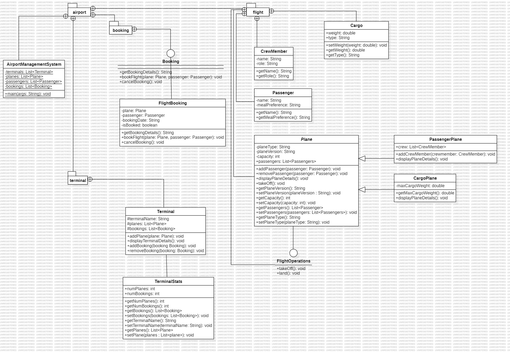

# Airport Management System

## Project Overview
The Airport Management System is a Java-based application designed to simulate the operation of an airport, including managing terminals, planes, passengers, bookings, and flight operations. The project utilizes a layered object-oriented design with abstract classes, interfaces, and hierarchical inheritance.

## Features
- **Terminal Management**: Handles international and domestic terminals, planes, and bookings.
- **Plane Management**: Includes PassengerPlane and CargoPlane classes to represent different types of planes.
- **Booking System**: Interfaces and classes to book, cancel, and retrieve flight details.
- **Flight Operations**: Manages takeoff and landing procedures for planes.
- **Passenger and Crew Management**: Tracks passenger details and crew members.

## Key Components
### 1. **Classes and Their Purposes**:
#### Airport.java
- Represents an airport with terminals and planes.
- Manages plane and booking operations.

#### Terminal.java
- Represents an airport terminal, including its planes and bookings.
- Includes methods to add planes and display terminal details.

#### Plane.java (Abstract Class)
- Base class for all plane types, managing passengers and capacity.

#### PassengerPlane.java (Extends Plane)
- Represents passenger planes, managing crew members and passengers.

#### CargoPlane.java (Extends Plane)
- Represents cargo planes, focusing on cargo operations and maximum cargo weight.

#### Booking.java (Interface)
- Provides methods for booking, canceling, and retrieving booking details.

#### FlightBooking.java (Implements Booking)
- Implements the Booking interface, managing individual flight bookings.

#### FlightOperations.java (Interface)
- Defines methods for takeoff and landing operations.

### 2. **Key Methods**:
#### Terminal
- `addPlane(Plane plane)`: Adds a plane to the terminal.
- `displayTerminalDetails()`: Displays terminal and booking details.

#### Booking Interface
- `bookFlight(Plane plane, Passenger passenger)`: Books a flight for a passenger.
- `cancelBooking()`: Cancels an existing booking.
- `getBookingDetails()`: Retrieves booking details.

#### FlightBooking
- Implements booking operations with additional validation for passengers and planes.

### 3. **Attributes**:
- `Plane`: Type, version, capacity, and passengers.
- `PassengerPlane`: Includes crew member details.
- `CargoPlane`: Manages cargo and weight constraints.

## How to Run the Project
1. Clone the repository to your local machine.
   ```bash
   git clone <repository-url>
   ```
2. Import the project into an IDE like IntelliJ IDEA or Eclipse.
3. Compile and run the `main` method in `Airport.java` to simulate airport operations.

## UML Diagram
The UML diagram of the project provides a detailed overview of the relationships and design structure among the components.



## Contribution
This project demonstrates a comprehensive approach to designing a complex system using object-oriented principles, including interfaces, inheritance, and encapsulation.

---